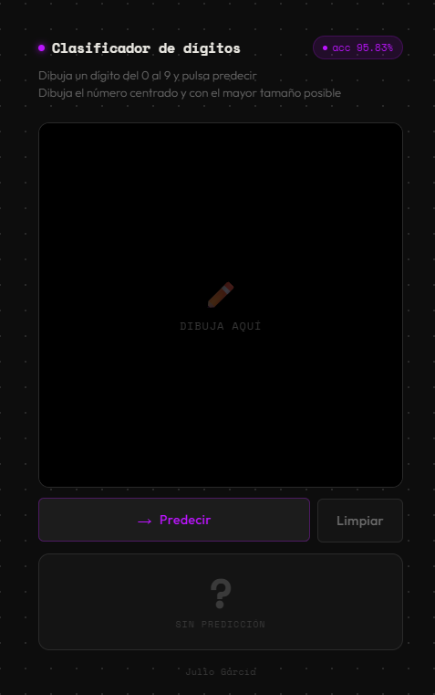
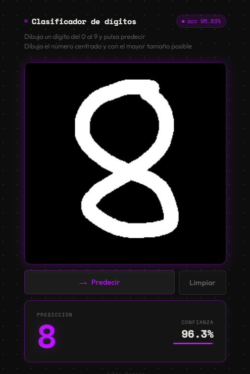

# Digit Classifier


---

## Descripción del Proyecto

<p align="center">
  
</p>

Aplicación web que clasifica dígitos escritos a mano (0–9) en tiempo real usando Machine Learning. El usuario dibuja un número en un canvas HTML y el sistema lo reconoce al instante, mostrando el dígito predicho y el porcentaje de confianza del modelo.

El proyecto sigue una arquitectura cliente-servidor: el frontend captura el dibujo, lo preprocesa en JavaScript para igualar el formato del dataset de entrenamiento, y lo envía a una API REST construida con Flask que devuelve la predicción.

### ¿Cómo funciona internamente?

1. El usuario dibuja un número en el canvas (256×256 px, fondo negro puro)
2. JavaScript preprocesa el dibujo: bounding box → centrado → reducción 8×8 → normalización max→16
3. El array de 64 valores se envía al endpoint `POST /predict` de la API Flask
4. Flask pasa los datos al modelo, que devuelve la predicción y la confianza
5. El resultado se muestra en pantalla con el dígito y una barra de confianza animada

---

## Estructura del Proyecto

```
digit-classifier/
├── app.py                  # Servidor Flask (API + web)
├── train.py                # Script de entrenamiento del modelo
├── model.pkl               # Modelo entrenado (generado durante el build)
├── requirements.txt        # Dependencias Python
├── Dockerfile              # Contenerización
├── README.md               # Este fichero
├── assets/                 # Imágenes para la documentación
├── templates/
│   └── index.html          # Estructura HTML de la interfaz
└── static/
    ├── style.css           # Estilos CSS
    └── app.js              # Lógica JS: canvas, preprocesado y API
```

---

## Descripción de cada fichero

### `train.py` — Entrenamiento del modelo

Carga el dataset `digits` de scikit-learn (1.797 imágenes de 8×8 píxeles, valores 0–16). Divide los datos en 80% entrenamiento y 20% test con **split estratificado** (`stratify=y`) para garantizar que cada clase esté igualmente representada en ambos conjuntos. Entrena un modelo de **Regresión Logística** y lo guarda junto con su precisión en `model.pkl` usando `pickle`.

> **Nota:** no se usa `StandardScaler` porque el preprocesado del canvas ya normaliza los datos al mismo rango (0–16, max→16) que el dataset. Añadir el scaler empeoraba las predicciones al distorsionar la distribución espacial de los píxeles.

### `app.py` — Servidor Flask

Al iniciarse carga el modelo desde `model.pkl`. Expone dos rutas:

- `GET /` — sirve la página HTML pasándole la precisión del modelo para mostrarla en la interfaz
- `POST /predict` — recibe un array de 64 floats preprocesado desde el cliente, ejecuta `model.predict()` y devuelve la predicción y la confianza en JSON

### `templates/index.html` — Estructura HTML

Contiene la estructura HTML de la interfaz, con el canvas de dibujo, los botones de predecir y limpiar, el panel de resultado y el footer.

### `static/style.css` — Estilos

Aplicamos estilo a la interfaz de index.html para mejorar el diseño. 

### `static/app.js` — Lógica del cliente

Contiene dos funciones principales: `preprocesar()`, que transforma el dibujo del canvas en el array de 64 valores que espera el modelo (bounding box, centrado, reducción a 8×8 y normalización), y `predecir()`, que envía esos datos a la API de Flask y actualiza la interfaz con el resultado. 

---

## Modelo de Machine Learning

| Parámetro | Valor |
|---|---|
| Dataset | digits de scikit-learn |
| Muestras | 1.797 imágenes de 8×8 píxeles |
| Clases | 10 (dígitos del 0 al 9) |
| Algoritmo | Regresión Logística  |
| Iteraciones máx. | 10.000 |
| Split | 80% train / 20% test |
| Precisión | 95% – 97% |

---

## Problemas encontrados durante el desarrollo

Esta sección recoge los bugs más importantes que aparecieron y cómo se resolvieron.

### Problema 1 — El CSS no cargaba

Al principio el CSS estaba enlazado con una ruta relativa que Flask no encontraba. Flask sirve los estáticos desde `static/` y hay que usar `url_for` para generar la ruta correcta. Un error básico pero que costó un rato localizar.

```html
<!-- MAL -->
<link rel="stylesheet" href="../templates/style.css">

<!-- BIEN -->
<link rel="stylesheet" href="{{ url_for('static', filename='style.css') }}">
```

### Problema 2 — Siempre predecía el número 4

Este fue el bug más gordo del proyecto. Da igual lo que dibujara: un 0, un 7, un 1... siempre salía un 4. Después de debugear con datos reales se encontraron tres causas combinadas:

- **Fondo del canvas incorrecto:** el canvas tenía fondo `#1A1A18` (valor 26 en RGB) en vez de negro puro `#000000`. Eso añadía un valor de ~1.6 a todos los píxeles de fondo en escala 0-16, y el modelo interpretaba ese ruido de fondo como si fuera el dígito 4.

- **Reducción directa sin recortar el trazo:** al reducir el canvas de 256×256 a 8×8 directamente, si el usuario dibujaba en el centro, el trazo ocupaba solo 1-2 píxeles en el resultado final. El modelo veía casi todo a cero, y el 4 era el dígito del dataset más parecido a esa distribución casi vacía.

- **La confianza llegaba como string:** la API devolvía la confianza como `"97.3%"` (string con el símbolo incluido). El JavaScript hacía `parseFloat()` sobre ese valor y fallaba silenciosamente, rompiendo la barra de confianza.

Las soluciones fueron: fondo `#000000` + umbral de ruido (píxeles < 30 → 0), preprocesado con bounding box para que el trazo ocupe siempre todo el espacio 8×8, y devolver la confianza como número float desde la API.

### Problema 3 — El StandardScaler empeoró las predicciones

Se añadió `StandardScaler` pensando que mejoraría la robustez del modelo, pero el resultado fue el contrario: las predicciones empeoraron bastante. Al analizarlo con datos reales se vio que el scaler aprende la media y desviación de cada píxel del dataset, y cuando los datos del canvas pasan por esa transformación, quedan desplazados fuera del espacio donde el modelo sabe clasificar. Sin scaler, con la normalización max→16 ya implementada en el cliente, los resultados mejoraron significativamente.

---

## Cómo ejecutar el proyecto
> ⚠️ Todos los comandos deben ejecutarse desde dentro de la carpeta `Aprendizaje_Supervisado`.

### Con Docker (recomendado)

El entrenamiento del modelo se ejecuta automáticamente durante el `docker build`.
```bash
# 1. Construir la imagen
docker build -t aprendizaje-supervisado .

# 2. Ejecutar el contenedor
docker run -p 5000:5000 aprendizaje-supervisado

# 3. Abrir en el navegador
http://localhost:5000
```

### Con Docker Compose

Crear un fichero `docker-compose.yml` en la raíz:

```yaml
services:
  digit-classifier:
    build: .
    ports:
      - "5000:5000"
```

```bash
docker compose up --build
```

### Sin Docker (local)

```bash
pip install -r requirements.txt
python train.py
python app.py
```

Abrir en el navegador: `http://localhost:5000`

---

## Uso de la Aplicación

<p align="center">
  
</p>

1. Dibuja un número (0–9) con el ratón o el dedo en el canvas negro
2. Pulsa **Predecir** para enviar el dibujo al modelo
3. Observa el resultado: dígito predicho y porcentaje de confianza
4. Pulsa **Limpiar** para borrar el canvas y probar con otro número


## Uso de Inteligencia Artificial
 
Durante el desarrollo se ha utilizado Claude como apoyo en varias fases del proyecto.
 
Debido a varios errores que cometi durante el desarrollo, no sabia como solucionarlos, por lo que use la IA para intentar solucionarlos, principalmente en los siguientes puntos:
 
- **Interfaz gráfica:** el diseño inicial era bastante básico y quería algo más currado, por lo que conseguí mejorar el diseño generado con la IA.
 
- **Bug de predicción:** el modelo siempre devolvía el dígito 4 independientemente de lo que se dibujara. Le pregunté a algún compañero y a ellos también les pasaba, no entendia muy bien porque pasaba esto. Despues de preguntarle a la IA me dijo que podía ser por los colores, ya que antes usaba otros pero me dijo que usando un fondo totalmente negro y un 'lápiz' blanco podía mejorar la precisión. Tambien me dijo que el trazo no se recortaba correctamente antes de reducirlo a 8×8 por lo que no se enviaba bien la imagen al modelo.
 
- **Preprocesado de imagen y JavaScript:** la función que transforma el dibujo del canvas en el array de 64 valores que espera el modelo (bounding box, centrado, reducción a 8×8 y normalización) la desarrolló la IA, ya que requería bastante lógica de manipulación de píxeles en JS. Ya que anteriormente usaba el StandardScaler pero despues de bastantes intentos, pruebas y preguntas a la IA entendía que este metodo standar parecía empeorar las predicciones.  